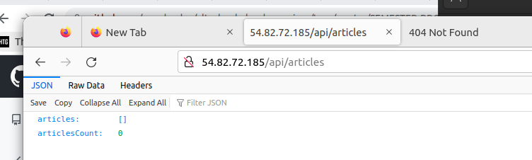

## PLEASE ACCESS MY WORK VIA THIS *SECURED* DOMAIN NAME [wandexdev.me](http://wandexdev.me)
 * 

# Question in this [google doc](https://docs.google.com/document/u/0/d/1dhO--9fqxrvU5Y6xC52-0AIplQe23LyscqSp6F0_9SM/mobilebasic)

`errors wouldnt k*ll me by his grace`

## SUMMARY STEPS (to be fully documented later)
 * Using an IAMadmin user on AWS, create 3 identical intances/linux machines.
   * First is workstation aka `master` with public ip 54.242.149.152
   * Second is slave-1-server `slave`  with public ip 54.82.72.185
   * Third is slave-2-server `slavex`
